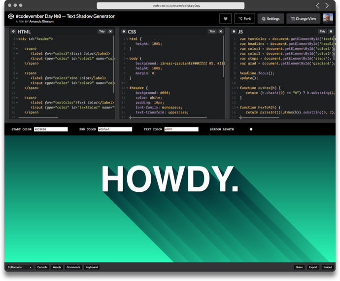

[Here is the link where u can find CodePen](https://codepen.io/)

## What is CodePen? 

CodePen allows you to write a code in the browser, and see the results of it as you build.  
It is also a community, where people can share there code and leave comments on others code.  
A single project on Codepen is called a ‘pen’. :memo:

> *" We're trying to make CodePen a happy and healthy place for front-end designers and developers and the people looking for  them, while also being a damn fine place to code. " :heart:*

## Why should you use CodePen?

Pro's | Con's 
--- | --- 
 **Supports** tons of languages such as of HTML, CSS, and JavaScript. |  If you want a private pen u need to **pay** and **upgrading** to a Pro account.a
 You can **add tags** to your pens (codes), which then become searchable. | The free version of Codepen has **ads** and requires **registration.**
 **Community** has been a huge part of CodePen since the beginning and you feel that. | **No** way to check **revision history.**

###### Pro's explaining:
1. For example u can use HAML, Markdown, Slim, or even Jade for HTML.
2. Searching tags such as “Loader” and “Form” brings up tons of helpful inspiration. 
3. Through comments and sharing, people can give and receive constructive criticism, and learn together.

###### Con's explainig:

- [ ]  If you want to make a own private pen u need to pay for a pro version of CodePen otherwise its always public.
- [ ]  In the free version of CodePen are the best tools not available.
- [ ]  You can't go back in your history about wich codes u used in your project after you closed it. You only can ctrl + z.

## Why did we choose CodePen?

* It's user friendly, it got structure and its not difficult to use. 
* Also is it verry handy that you immediately see what your code is doing or what it is not doing. 
* It's a bit different then other IDE's cause you make your code in a browser. 

